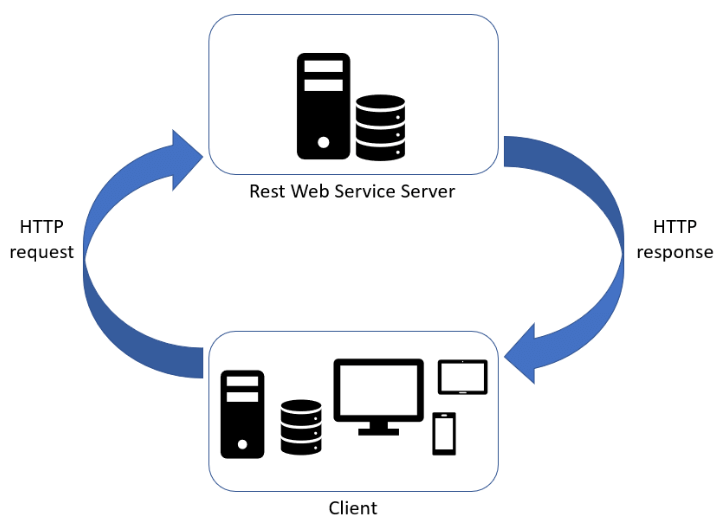
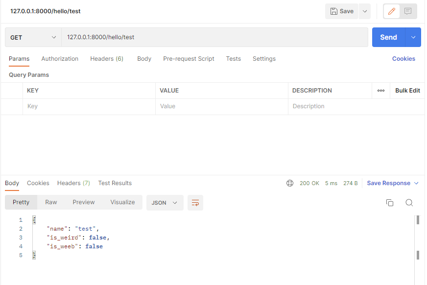

# Create your own REST API

## Explanations
___What is a REST API? Why should I know how to use/code a REST API?___

> ### Schema


> ### Example
By example, if you want to interact with the <a href="https://developer.riotgames.com/apis">Riot API</a> you will have to perform a request with a token (so it can authenticate the entity who is performing the request), if the request succeeds a JSON value will be returned with the information of a Summoner.

-> The website <a href="http://exobuilds.cc">ExoBuilds</a> is performing requests to the <a href="https://developer.riotgames.com/apis">Riot API</a> to retrieve different summoners.
> <a href="https://github.com/ExoBuilds/Website">GitHub</a>


## Prerequisites
* Download cargo with `sudo apt-get install cargo`
* Download postman here: <https://www.postman.com/downloads/>
* `mkdir rest_api && cd rest_api`
* `cargo init`
* Open the generated `Cargo.toml` and set the following line:
```cargo
[dependencies]
rocket = "0.5.0-rc.2"

```
* Run `cargo run` to check if everything is good;
> The output should look like this:
```bash
Hello, world!
```

* Replace the default `src/main.rs` generated by the command `cargo init` with the recommended default `src/main.rs` by the framework.
```rust
use rocket::*;

#[get("/hello/<name>")]
fn hello(name: &str) -> String {
    format!("Hello, {}!", name)
}

#[launch]
fn rocket() -> _ {
    rocket::build().mount("/", routes![hello])
}
```

## Run it with `cargo run`
*The webapp server should be started at the address: <http://127.0.0.1:8000>*

* Now try to access <http://127.0.0.1:8000/hello/samira>
> You should see "Hello, samira!" 

## Some explanations
```rust
#[get("/hello/<name>")]
```
This macro can be define as:
* A request of type: GET
* A request located at the path `/hello/`
* A request with an unique parameter of type string

*But what if the parameter `name` was something else other than a string??? You could say...*
> Well Watson, the `rocket.rs` framework is well-made.
The server attends a request having for parameter a string, if it's not a string, the server will return a 404 page as it does not found the desired request.

## Time to create a real REST API!
Yes, as far as we are, this is not a REST API, YET!

Usually, a REST API returns a JSON value.

### Steps
* Create `src/user_model.rs`
```rust
use serde::{Serialize, Deserialize};

#[derive(Serialize, Deserialize, Default)]
pub struct User {
    pub name: String,
    pub is_weird: bool,
    pub is_weeb: bool,
}
```

* In the beginning of `src/main.rs` add the following:
```rust
use rocket::serde::json::Json;

mod user_model;
use user_model::User;

```rust
#[get("/hello/<name>")]
fn hello(name: &str) -> Result<Json<User>, String> {
    ...
}
```

### Tasks
* Return a `User` with `name`.
* If the name starts with `py` or `js` set `is_weird` to `true`.
* If the name has more than 3 O's or more than 3 A's set `is_weeb` to `true`.

> What you should have:



#### Some help?
```rust
// Create a user
    let test_user = User {
        name: "Izuwe".to_string(),
        ..Default::default()
    };

// Return an ok Result
let result: Result<Json<String>, ()> = Ok(Json("Yes!".to_string()));

// Return an err Result
let result: Result<(), Json<String>> = Err(Json("Nop :(".to_string()));
```
